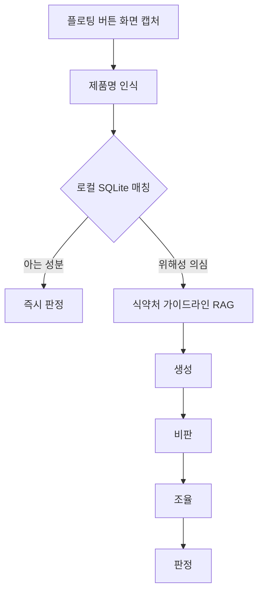

아이디어가 정해지고 기획자 셋이 화면 흐름을 짜는 동안, 나는 아키텍처를 그렸다. 이 편에서 내린 결정은 두 개다. 둘 다 같은 질문에서 나왔다. 이 앱이 실제로 쇼핑하는 도중에 쓰일까.

## 앱을 여는 순간 진다

첫 번째 결정은 화면 전환 없이 스캔할 수 있어야 한다는 것이었다.

동선을 그려보면 답이 빤하다. 쿠팡에서 제품 상세 페이지를 보고 있다. 스크롤을 내리면 원재료 명세가 나오는데, 읽어도 판단이 안 선다. 여기서 앱을 떠올린다고 치자. 쿠팡을 나가서, 우리 앱을 찾아서, 열고, 제품명을 다시 타이핑하고, 검색하고, 결과를 보고, 다시 쿠팡으로 돌아와서 아까 보던 페이지를 다시 찾는다. 이 과정을 장바구니에 담을 때마다 반복할 사람은 없다. 한 번은 한다. 두 번째부터 안 한다.

앱을 나가게 만드는 순간 진다. 쇼핑은 흐름이고, 흐름이 끊기면 사용자는 확인을 포기하지 앱으로 돌아오지 않는다.

그래서 플로팅 버튼을 만들었다. 어떤 화면 위에도 떠 있고, 누르면 그 자리에서 화면을 캡처해 제품명을 인식한다. 쿠팡을 나가지 않는다. 앱으로 들어가는 게 아니라 앱이 따라다니는 쪽이다.

이 결정의 부수 효과가 하나 더 있었다. 쇼핑몰을 안 가린다는 것. 쿠팡이든 마켓컬리든 네이버 검색 결과든, 화면에 제품명이 떠 있으면 그대로 스캔된다. 쇼핑몰마다 API 연동을 뚫었으면 대회 기간 안에 한 곳도 못 붙였을 거고, 붙인 그 한 곳 밖에서는 아무 쓸모도 없었을 거다.

## 매번 클라우드로 보내면 느리고 비싸다

두 번째는 속도와 비용이었다.

스캔할 때마다 클라우드로 올려서 판정을 받아오면 구조는 단순하다. 대신 매 요청이 왕복 지연을 먹고, 요청 수만큼 돈이 나간다. 장바구니 채우면서 열 개를 확인하면 열 번을 기다린다. 앞에서 플로팅 버튼으로 아낀 시간을 여기서 다시 토해내는 셈이다.

그래서 단계를 나눴다. 로컬 SQLite 로 1차 매칭을 건다. 이미 아는 성분이면 클라우드까지 안 가고 그 자리에서 답이 나온다. 위해성이 걸리는 경우에만 다음 단계로 넘긴다. 그때는 식약처 가이드라인을 근거로 RAG 를 태우고, 생성과 비판과 조율로 역할을 나눠 세 번 검증한다.

여기서 중요한 건 세 번 검증한다는 사실 자체가 아니라, 세 번을 아무 때나 돌리지 않는다는 쪽이다. 흔한 성분 하나 확인하는 데 검증 세 바퀴를 돌리면 그건 정확한 게 아니라 느린 거다. 판단이 어려운 자리에만 비용을 몰아줬다.

## 순조로웠다

여기까지는 계획대로 굴러갔다. 화면 흐름이 나왔고, 파이프라인이 섰고, 데모에서 보여줄 그림이 그려졌다.

문제는 그 다음이었다. 이 파이프라인에는 아직 답하지 않은 칸이 하나 남아 있었다. 로컬에도 없고 가이드라인에도 없는 성분이 나오면 뭘 보여줄 것인가.

그 칸을 두고 팀에서 제일 오래 다퉜다. 다음 편은 그 얘기다.
